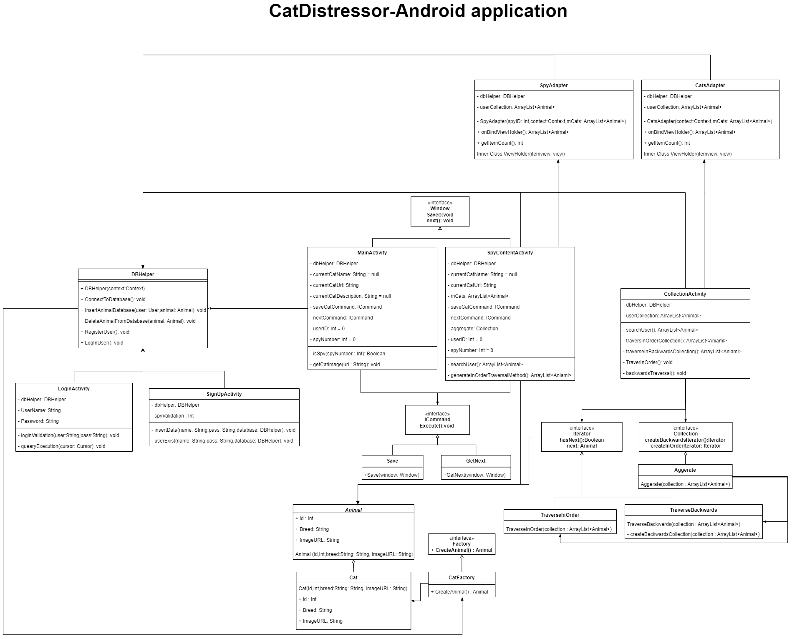

# Cat-distressor-android-application

##### Christof du Toit

Georgi Dimitrov

Vlad Atamanciuc

### Description of application:

##### SignUp activity:

This activity is used to create a user who can save cats. 

Activation of the Spy user can be done with the hidden button found at the top right of the application!

##### Login activity:

Used to log a user that was created in the SignUp page.

##### Main activity:

This activity is used to save cats to their collection. (Spy and Normal user)

The extra spy collection button for the Spy will only be available if a Spy is logged in. This button will redirect the user to the SpyContentActivity.

##### Collection Activity:

This activity displays the user's cats that were saved in the MainActivity and the SpyContentActivity.

This activity includes 2 traversal methods to order the saved cats. 

*Note: Collection will only display a name if the API has provided a breed and description*

##### SpyContent Activity:

This activity is used by the spy to search for other users collections and save selected cats to their own collection.

##### DBHelper:

This class is used to execute queries to the database.

##### Adapters:

The adapter classes are used to translate received information into a RecyclerView to be displayed in the UI. 

The adapter classes are critical to the function of the application as it is required to display lists of items, and is used for updating of the UI, if items within the RecyclerView is changed or removed.

# Class Diagram
Please keep in mind that the diagram does not contain the class from andorid studio such as buttons, views, ext.

